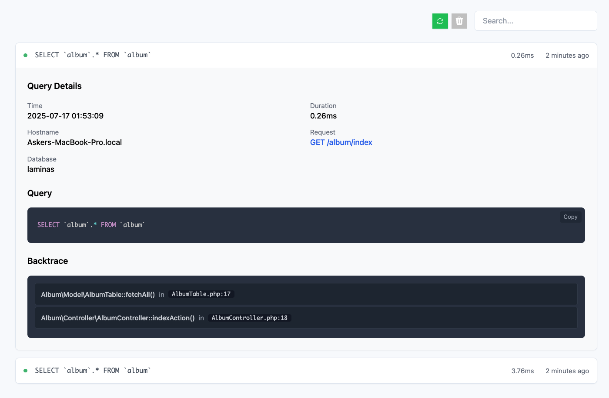

# Laminas Lens - Query Logger

A sleek, simple, and developer-friendly SQL query logger for Laminas MVC applications.


### Quick Start

1. **Install via Composer**

   ```bash
   composer require askerakbar/lens --dev


2. **Register the module** (if not auto-discovered):
   Add to `config/modules.config.php`:

   ```php
   AskerAkbar\Lens
   ```

3. **Run the migration** to create the database table (see [Storage](#storage)).

4. **Access the UI** by visiting `/lens` in your browser.

> You'll see a dashboard like this:
> 

> **Note:** Database storage is enabled by default and requires the migration.

---

## Features

* Logs all executed DB queries
* Displays SQL, parameters, timing, stack trace, and connection info
* Search functionality
* database-backed storage

---

### Notes

This library has been tested **only** against:

* **Laminas MVC ^3.7.0**
* **PHP 8.1 / 8.2 / 8.3**
* **PDO\_MySQL** (MySQL / MariaDB)
* **Requires `laminas/laminas-cli`**
* Requires database connection to be configured

> This tool is intended for development use only. Other DB backends, PHP, or other Laminas versions are  **untested** and may not work as expected. 
> if you find issues please feel free to make a PR.

---

## Storage

### Database Storage

Database storage is the default and requires a database table to be created. Configure your app config with the following in (`config/autoload/global.php` or `local.php`) if needed:

```php
'lens' => [
    'storage' => [
        'type'  => 'database',
        'table' => 'lens_logs', // Optional, default: lens_logs
    ],
],
```

---

### Running the Migration

1. **Publish migration:**

   ```bash
   vendor/bin/laminas lens:publish-migration
   # Optional target directory:
   vendor/bin/laminas lens:publish-migration --target=database/migrations
   ```

2. **Run the migration:**
   This generates a standard SQL file—execute it using your preferred method.

---

### Troubleshooting

### Xdebug: Segmentation Fault When Publishing Migrations

If you see errors like:

```
Cannot load Xdebug - it was already loaded
Xdebug: [Step Debug] Could not connect to debugging client...
Segmentation fault (core dumped)
```

Disable Xdebug for the session:

```bash
export XDEBUG_MODE=off
vendor/bin/laminas lens:publish-migration --target=database/migrations
```

---

### License

MIT License. See [License.md](License.md) for details.

